# adaptive_ui_lab

Bitta ilova, bitta kod bazasi, bitta maʼlumot manbasi — **ikki xil UI daraxti**.
Android'da toʻliq Material 3, iOS'da toʻliq Cupertino. `.adaptive` konstruktorlari
(`Switch.adaptive`, `CircularProgressIndicator.adaptive`, `showAdaptiveDialog`, …)
**ataylab ishlatilmagan**: maqsad — farqni yashirish emas, koʻrsatish.

```bash
flutter pub get
flutter run
```

## Arxitektura

```
lib/
├── main.dart                         # MultiBlocProvider → ValueListenableBuilder → Material yoki Cupertino
├── core/app/app_restart_controller.dart    # ilovani qayta qurish signali
├── core/platform/ui_platform.dart    # UiPlatform, UiStyleMode
├── core/platform/platform_controller.dart  # butun loyihada defaultTargetPlatform ishlatiladigan YAGONA joy
├── core/router/app_routes.dart
├── data/models/                      # Child, ScheduleItem, AppSettings (Equatable)
├── data/fake_repository.dart         # in-memory fixtures + 300–800 ms sunʼiy kechikish
├── state/                            # children_bloc, schedule_bloc, settings_bloc — ikkala UI uchun bitta
└── ui/
    ├── material/                     # faqat package:flutter/material.dart
    ├── cupertino/                    # faqat package:flutter/cupertino.dart (+ services.dart)
    └── shared/                       # matn va format helperlari, widget YOʻQ
```

Chegaralarni buyruq bilan tekshirish mumkin:

```bash
grep -rn "Platform.isIOS\|defaultTargetPlatform" lib/     # faqat platform_controller.dart
grep -rn "package:flutter/cupertino.dart" lib/ui/material/ # boʻsh
grep -rn "package:flutter/material.dart" lib/ui/cupertino/ # boʻsh
grep -rn "\.adaptive\|showAdaptiveDialog" lib/             # boʻsh
```

`state/` va `data/` ichida `Platform.isIOS` ham, `Theme.of` ham yoʻq — sof logika.
Bloc'lar `MaterialApp`/`CupertinoApp` dan **yuqorida** turadi, shuning uchun UI rejimi
almashganda ilova butunlay qayta qurilsa ham roʻyxat, qidiruv matni va sozlamalar joyida qoladi.

## Widget xaritasi

| Element | Material daraxti | Cupertino daraxti |
|---|---|---|
| Ildiz | `MaterialApp` + `ThemeData(ColorScheme.fromSeed)` | `CupertinoApp` + `CupertinoThemeData` |
| Karkas | `Scaffold` + `AppBar` / `SliverAppBar.large` | `CupertinoPageScaffold` + `CupertinoNavigationBar` / `CupertinoSliverNavigationBar` |
| Pastki navigatsiya | `NavigationBar` (M3) | `CupertinoTabScaffold` + `CupertinoTabBar` (har tab oʻz `Navigator` i bilan) |
| Marshrut | `MaterialPageRoute` | `CupertinoPageRoute` (chetdan surib qaytish ishlaydi) |
| Roʻyxat | `Card` + `ListTile` + `Divider` | `CupertinoListSection.insetGrouped` + `CupertinoListTile.notched` |
| Qidiruv | `SearchBar` | `CupertinoSearchTextField` |
| Matn maydoni | `TextField` + `OutlineInputBorder` | `CupertinoTextField` + `CupertinoFormSection` / `CupertinoFormRow` |
| Tugmalar | `FilledButton`, `OutlinedButton`, `TextButton`, `FloatingActionButton` | `CupertinoButton.filled`, `CupertinoButton`, nav bar'da `CupertinoButton(padding: zero)` |
| Switch | `Switch` | `CupertinoSwitch` |
| Slider | `Slider` | `CupertinoSlider` |
| Checkbox / radio | `Checkbox`, `RadioGroup` + `Radio` | `CupertinoCheckbox`, `RadioGroup` + `CupertinoRadio` |
| Segment / tab | `TabBar` + `TabBarView`, `SegmentedButton`, `FilterChip` | `CupertinoSlidingSegmentedControl` |
| Dialog | `AlertDialog` (`showDialog`) | `CupertinoAlertDialog` (`showCupertinoDialog`) |
| Harakatlar menyusi | `showModalBottomSheet` + `ListTile` | `CupertinoActionSheet` (`showCupertinoModalPopup`), `CupertinoContextMenu` |
| Qisqa xabar | `SnackBar` + `SnackBarAction` (`ScaffoldMessenger`) | oʻz `CToast` overlay'i (pastdan chiqadi) |
| Oʻchiq tugma | `TextButton(onPressed: null)` | `CupertinoButton(onPressed: null)` |
| Loading | `CircularProgressIndicator`, `LinearProgressIndicator` | `CupertinoActivityIndicator` |
| Pull-to-refresh | `RefreshIndicator` | `CupertinoSliverRefreshControl` |
| Sana tanlash | `showDatePicker` | `CupertinoDatePicker` (`showCupertinoModalPopup` ichida) |
| Roʻyxatdan tanlash | `DropdownMenu` | `CupertinoPicker` (modal popup ichida) |
| Swipe amallari | `Dismissible` | uzoq bosish → `CupertinoActionSheet` (+ tafsilotda `CupertinoContextMenu`) |
| Tipografiya | `Theme.of(context).textTheme` | `CupertinoTheme.of(context).textTheme` |
| Ikonkalar | `Icons.*` | `CupertinoIcons.*` |
| Scroll fizikasi | sukut boʻyicha (Android overscroll glow) | `BouncingScrollPhysics` |
| Haptika | — | `HapticFeedback.selectionClick()` / `mediumImpact()` |

## Toʻgʻri ekvivalenti yoʻq joylar

**SnackBar.** iOS'da SnackBar tushunchasi yoʻq — HIG'da "amalni bekor qilish" uchun
alohida naqsh berilmagan. Material tomonda `ScaffoldMessenger` + `SnackBarAction('Bekor qilish')`
ishlatilgan. Cupertino tomonda `lib/ui/cupertino/c_toast.dart` — `Overlay` ustida pastdan
sirgʻalib chiqadigan, 3 soniyadan keyin oʻzi yoʻqoladigan oʻz toast'i yozilgan; oʻchirishning
oʻzi esa avval `CupertinoActionSheet` dagi destructive amal orqali boshlanadi. Yaʼni bitta
biznes amali (oʻchirish + bekor qilish) ikki platformada ikki xil naqsh bilan berilgan.

**FAB.** Cupertino'da suzuvchi tugma yoʻq. Material'da `FloatingActionButton.extended`,
Cupertino'da esa navigatsiya panelining oʻng tomonidagi `+` tugmasi.

**Orqaga qaytish.** Material'da `AppBar` ning chap yuqorisidagi strelka.
Cupertino'da `CupertinoNavigationBar(previousPageTitle: 'Bolalar')` — "‹ Bolalar" matni
va `CupertinoPageRoute` bergan chetdan surib qaytish imkoniyati.

**Menyu.** Material'da `showModalBottomSheet` ichida `ListTile` lar;
Cupertino'da `CupertinoActionSheet` (destructive/default amallar ajratilgan holda).

**Tab navigatsiyasi.** Material'da bitta `Navigator` va `IndexedStack`;
Cupertino'da `CupertinoTabScaffold` har bir tabga alohida `Navigator` beradi, shuning uchun
tafsilot ekrani tab panelining **ustida emas, ichida** ochiladi. Yana bir farq:
`CupertinoTabBar` kontentning **ustida** turadi, shuning uchun Cupertino ekranlarining
oxiriga `MediaQuery.paddingOf(context).bottom` qoʻshilgan — busiz roʻyxatning oxirgi
elementi panel ostida qolib, bosib boʻlmaydi. Material'da `Scaffold` buni oʻzi hal qiladi.

**Segment.** Material'da "Bugun / Hafta" `TabBar` + `TabBarView` (surib almashadi),
Cupertino'da `CupertinoSlidingSegmentedControl` (sirgʻaluvchi indikator).

## Shrift oʻlchami: kutilayotgan qiymat va qayta ishga tushirish

Shrift slideri UI shriftini **darhol oʻzgartirmaydi**. `AppSettings` da ikkita qiymat bor:

- `fontScale` — hozir qoʻllanilgan (ilova shu bilan chiziladi)
- `pendingFontScale` — sliderdagi, hali qoʻllanmagan qiymat

Slider faqat `pendingFontScale` ni oʻzgartiradi (`SettingsFontScaleChanged`). Ikkalasi
farq qilganda (`hasPendingFontScale`) ekranda **qayta ishga tushirish taklifi** paydo boʻladi.
"Yangilash" bosilganda `SettingsFontScaleApplied` yuboriladi — `fontScale = pendingFontScale` —
va ilova qayta quriladi, yangi shrift shundan keyin koʻrinadi.

Yonidagi **Standart** tugmasi `pendingFontScale` ni 100% ga qaytaradi (qiymat allaqachon 100%
boʻlsa tugma oʻchiq). U ham xuddi shunday — faqat qayta ishga tushirilgandan keyin qoʻllanadi.

Taklif ikki joyda, ikkala platformada ham oʻz naqshi bilan:

| | Material | Cupertino |
|---|---|---|
| Vaqtinchalik taklif | `SnackBar` + `SnackBarAction('Yangilash')` | `CToast` + `CupertinoButton('Yangilash')` |
| Doimiy koʻrsatkich | slider ostidagi izoh qatori + `TextButton` | boʻlim ichida "Yangilash" qatori + `CupertinoListTileChevron`, izoh esa boʻlim `footer` ida |
| Standart tugmasi | `TextButton(onPressed: null)` | `CupertinoButton(onPressed: null)` |

Vaqtinchalik taklif yoʻqolib ketsa ham doimiy koʻrsatkich qoladi, shuning uchun sliderni
qayta tortish shart emas. Taklif faqat qiymat **haqiqatan** farq qilganda chiqadi: slider
`onChangeEnd` da yangi qiymat qoʻllanilgan qiymat bilan solishtiriladi, shuning uchun
sliderga tegib qoʻyish yoki qiymatni oʻz joyiga qaytarish bezovta qilmaydi.

"Yangilash" `AppRestartController.restart()` ni chaqiradi. `main.dart` da UI daraxti
`KeyedSubtree(key: ValueKey(tick))` ichida, `MultiBlocProvider` esa undan **yuqorida** —
shuning uchun butun UI daraxti noldan quriladi (bu jarayonni emas, interfeysni qayta ishga
tushirish), lekin **maʼlumot, tanlangan tab va sozlamalar qiymatlari saqlanib qoladi**.

| | Slider surildi — shrift hali oʻzgarmagan | "Yangilash" bosilgandan keyin |
|---|---|---|
| Android | 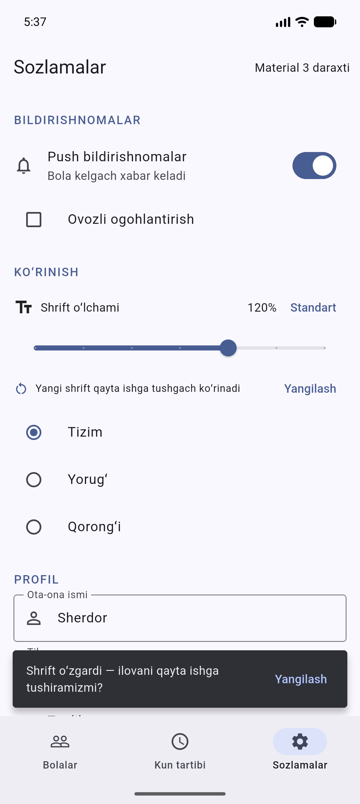 | 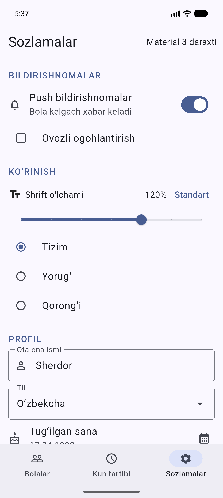 |
| iOS | 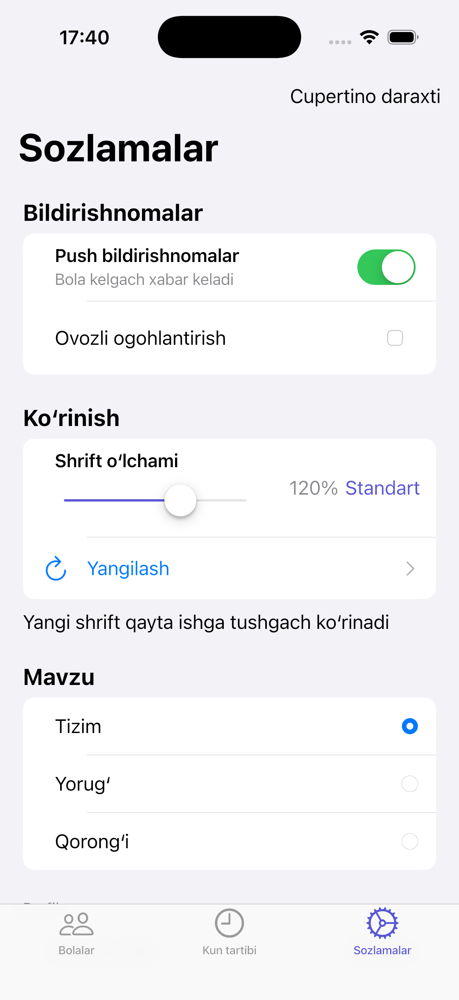 | 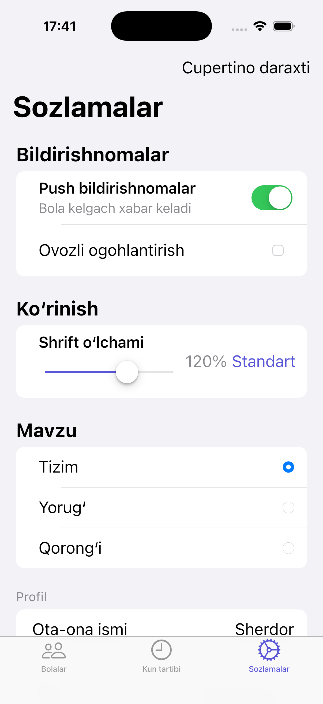 |

Yon foyda: slider tortilayotganda ildizdagi `MediaQuery.withClampedTextScaling` qiymati
oʻzgarmaydi, shuning uchun har bir harakatda butun daraxt qayta chizilmaydi.

## Bitta qurilmada ikkala UI

Sozlamalar → **UI rejimi (sinov)** → `Tizim / Material / Cupertino`.

- `Tizim` — `defaultTargetPlatform` (iOS/macOS → Cupertino, qolgani → Material)
- `Material` / `Cupertino` — majburiy rejim

Rejim `PlatformController.mode` (`ValueNotifier<UiStyleMode>`) orqali oʻzgaradi,
`main.dart` esa butunlay boshqa ildiz widget quradi. Tanlangan tab `PlatformController.tabIndex`
da saqlanadi, maʼlumot bloc'larda qoladi — shuning uchun almashish "joyida" boʻlib koʻrinadi.

## Testlar

```bash
flutter analyze     # 0 ogohlantirish
flutter test        # 43 ta test
```

- `children_bloc_test.dart`, `schedule_bloc_test.dart`, `settings_bloc_test.dart` —
  UI'dan mustaqil bloc testlari (qidiruv, filtr, refresh, xato, oʻchirish/bekor qilish,
  sozlamalar saqlanishi). Bu testlar **bitta** va ikkala UI uchun umumiy.
- `material_widget_test.dart` — `debugDefaultTargetPlatformOverride = TargetPlatform.android`:
  `Scaffold`, `NavigationBar`, `Switch`, `AlertDialog`, `BottomSheet` topiladi;
  `CupertinoPageScaffold`, `CupertinoTabBar`, `CupertinoSwitch` **topilmaydi**.
- `cupertino_widget_test.dart` — `TargetPlatform.iOS` bilan aynan teskarisi.
- `same_data_test.dart` — bitta bloc holatidan ikkala daraxt ham bir xil matnlarni chizadi;
  majburiy rejim tizim platformasini bekor qiladi; Material sozlamalaridan Cupertino'ga va
  Cupertino sozlamalaridan Material'ga oʻtish ishlaydi; rejim almashganda qidiruv natijasi va
  tanlangan tab saqlanadi.
- `golden_test.dart` — `test/goldens/` ichidagi 4 ta golden fayl (`--update-goldens` bilan yangilanadi).
- `font_scale_test.dart` — ikkala UI'da: slider surilganda `MediaQuery.textScalerOf` **oʻzgarmasligi**,
  taklif va doimiy koʻrsatkich chiqishi, "Yangilash" bosilgandan keyin qoʻllanilgan shrift
  kutilayotgan qiymatga tenglashishi, "Standart" tugmasining oʻchiq/faol holatlari.
- `performance_test.dart` — quyidagi optimallashtirishlarni qoʻriqlaydi: hosila qiymatlar
  keshlanishi, kun tartibining parallel yuklanishi, tablarning dangasa qurilishi va
  qidiruvda yozilganda AppBar qayta chizilmasligi.

Har test oxirida `debugDefaultTargetPlatformOverride = null`.

## Skrinshotlar

| Ekran | Android (Material 3) | iOS (Cupertino) |
|---|---|---|
| Bolalar roʻyxati | 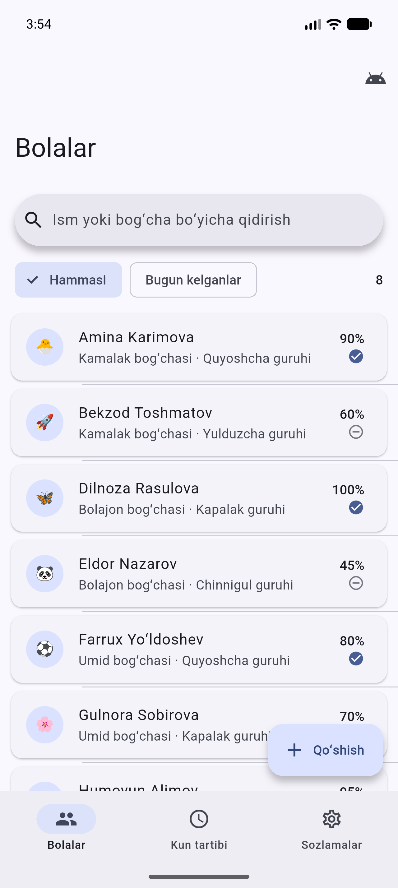 |  |
| Bola tafsiloti | 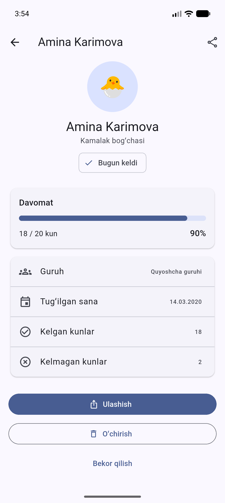 | 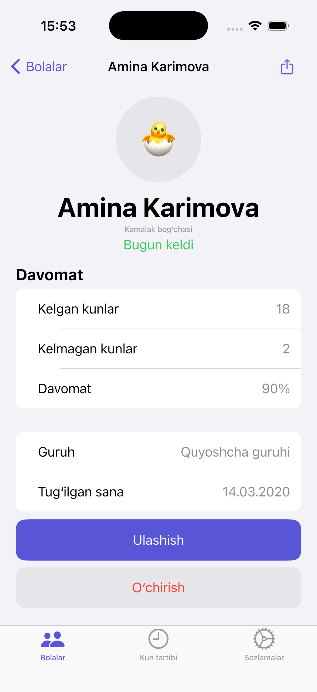 |
| Kun tartibi | 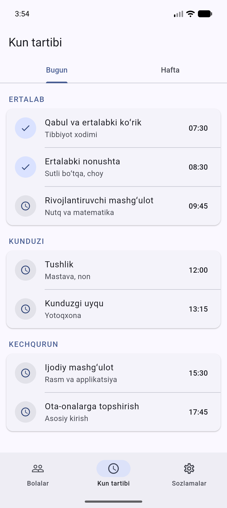 | 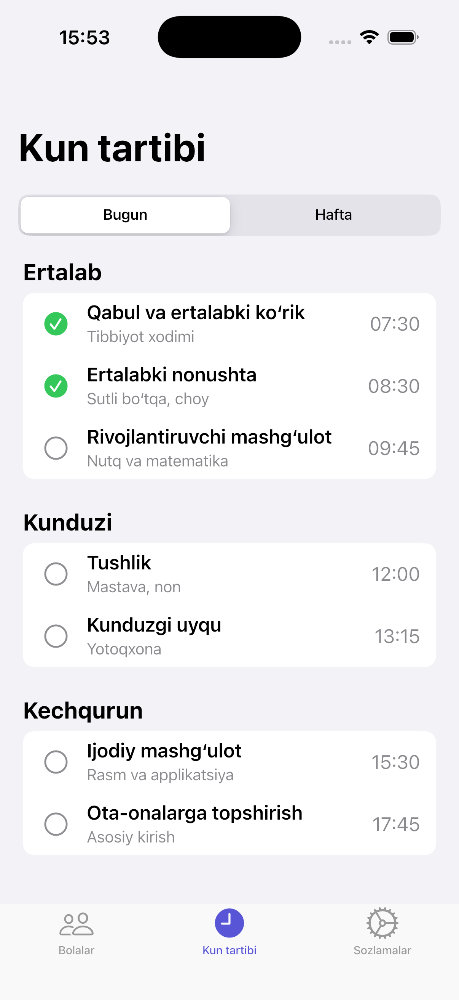 |
| Sozlamalar | 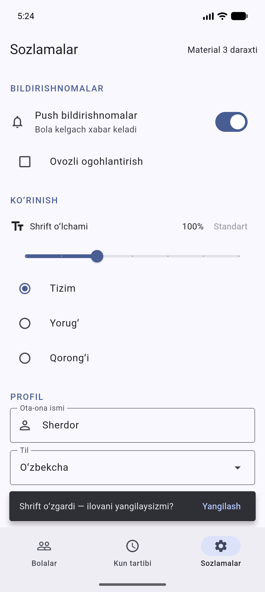 | 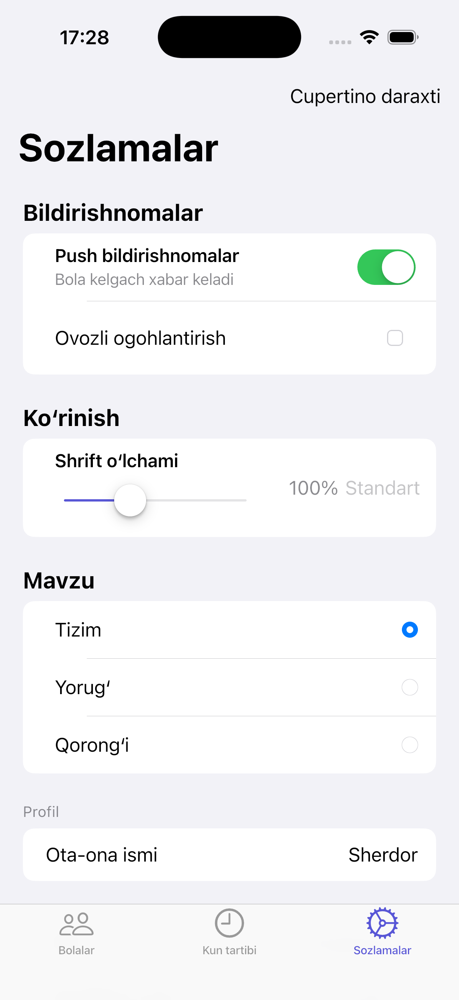 |

Rejim almashtirish va qorongʻi mavzu:

| Android'da majburiy Cupertino | iOS'da majburiy Material | iOS qorongʻi mavzu |
|---|---|---|
| 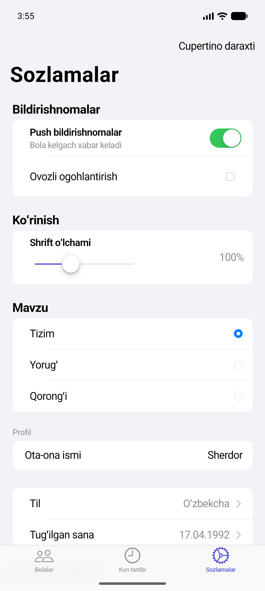 | 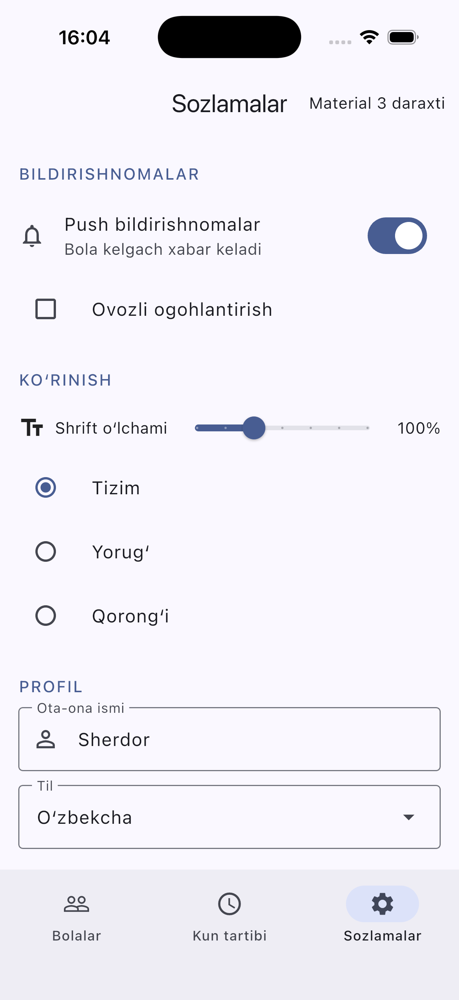 | 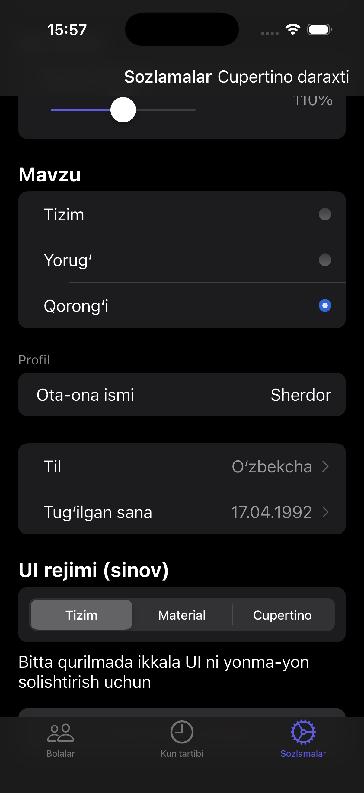 |

Chap ustundagi skrinshot Android emulyatorida olingan: Sozlamalar → UI rejimi → Cupertino
bosilgach, oʻsha qurilmada UI toʻliq Cupertino'ga aylandi, tanlangan tab va sozlamalar
qiymatlari (Sherdor, 17.04.1992, bildirishnomalar yoqilgan) joyida qoldi. Oʻrtadagi
skrinshot — iOS simulyatorida teskari yoʻnalish.

## Optimallashtirish

Ilova silliq ishlashi uchun qilinganlar — barchasi `performance_test.dart` bilan qoʻriqlanadi:

**Hosila qiymatlar keshlanadi.** `ChildrenState.visibleChildren` va
`ScheduleState.sectionsFor()` avval har chaqirilganda qaytadan hisoblanardi (build ichida
bir necha marta). Endi ular `late final` maydon — holat obyekti uchun bir marta hisoblanadi.
Filtr ham, qidiruv ham boʻsh boʻlsa umuman nusxa olinmaydi, aynan bir roʻyxat qaytadi.

**O(n²) yoʻqotildi.** `c_schedule_page.dart` da har bir boʻlim uchun `sectionsFor()` qaytadan
guruhlab, ustiga `entries.elementAt(index)` bilan chiziqli qidiruv qilinardi. Endi boʻlimlar
roʻyxati build boshida bir marta olinadi.

**Qayta chizish qamrovi toraytirildi.** Avval butun ekran bitta `BlocBuilder` ichida edi —
qidiruvga bitta harf yozilganda `SliverAppBar` / `CupertinoSliverNavigationBar`, qidiruv
maydoni, segment va butun roʻyxat qaytadan chizilardi. Endi har boʻlak oʻz qamrovida:
navigatsiya paneli umuman qayta chizilmaydi, filtr va sanoq `BlocSelector` bilan,
roʻyxat esa `buildWhen` bilan — **natija oʻzgarmasa roʻyxat umuman qayta chizilmaydi**.
Sozlamalarda har bir qator `context.select` bilan oʻz maydoniga ulangan: switch bosilganda
slider ham, matn maydoni ham qayta chizilmaydi.

**Tablar dangasa quriladi.** `IndexedStack` uchala sahifani birdan qurar edi (ishga tushishda
3 ta ekran + 2 ta ortiqcha yuklash). Endi faqat koʻrilgan tab quriladi — Cupertino tomondagi
`CupertinoTabView` xatti-harakati bilan bir xil. Koʻrilgandan keyin tab tirik qoladi,
shuning uchun qidiruv matni va scroll holati saqlanadi.

**Parallel yuklash.** `ScheduleBloc` "bugun" va "hafta" maʼlumotini ketma-ket
(300–800 ms + 300–800 ms) yuklardi; endi `Future.wait` bilan bir vaqtda — kutish taxminan
ikki barobar qisqardi.

**Animatsiya resursi.** `CToast` har `build` da yangi `CurvedAnimation` yaratardi va
avtomatik yopilish `Future.delayed` da edi. Endi animatsiya bir marta yaratilib `dispose`
qilinadi, taymer esa `Timer` — widget yoʻqolganda bekor qilinadi.

## Chegaralar

- Backend yoʻq — barcha maʼlumot `lib/data/fake_repository.dart` dagi fixtures.
- Kodda izoh yozilmagan; tushuntirish shu README'da.
